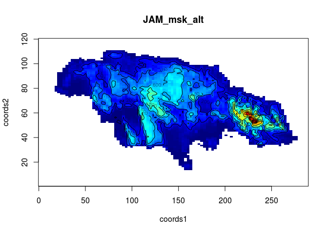

geo2smoof
=========

[](https://travis-ci.org/jakob-r/geo2smoof) [](https://ci.appveyor.com/project/jakob-r/geo2smoof) [](https://coveralls.io/github/jakob-r/geo2smoof?branch=master)

Convert a elevation RasterLayer from the package raster or an Google Maps Elevation API Call to a function that you can optimize.

-   [Issues and Bugs](https://github.com/jakob-r/geo2smoof/issues)
-   [Tutorial and Documentation](https://jakob-r.github.io/geo2smoof)

Installation
------------

``` r
devtools::install_github("jakob-r/geo2smoof")
```

``` r
library(geo2smoof)
# list available countries
# raster::getData('ISO3')
alt = raster::getData('alt', country='JAM')
sf = convertRasterLayerToSmoof(raster.layer = alt)
plot2DNumeric(sf, render.levels = TRUE)
```



``` r
# find the highest point with optim()
optim(c(140,80), fn = function(...) -1 * sf(...), )
```

    ## $par
    ## [1] 142.75146  87.33496
    ## 
    ## $value
    ## [1] -762
    ## 
    ## $counts
    ## function gradient 
    ##       29       NA 
    ## 
    ## $convergence
    ## [1] 0
    ## 
    ## $message
    ## NULL
